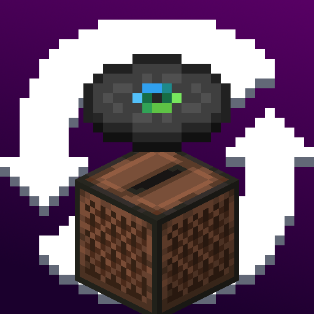

# Jukebox Looping

Changes Jukeboxes so that when a disc finishes playing, instead of just stopping, the song loops.

The mod doesn't need to be installed client-side, it works fine when installed only on the server.

Jukeboxes won't loop if they're placed above a block entity.
This allows redstone contraptions that use discs, such as disc shufflers, to continue working.
Since hoppers are block entities, songs won't loop, and any creation using them can simply take the disc out as normal.

This can also be used to make non-looping jukeboxes if you need to;
simply place it above a block entity that doesn't interact with Jukeboxes (e.g. Barrels) and the song won't loop.